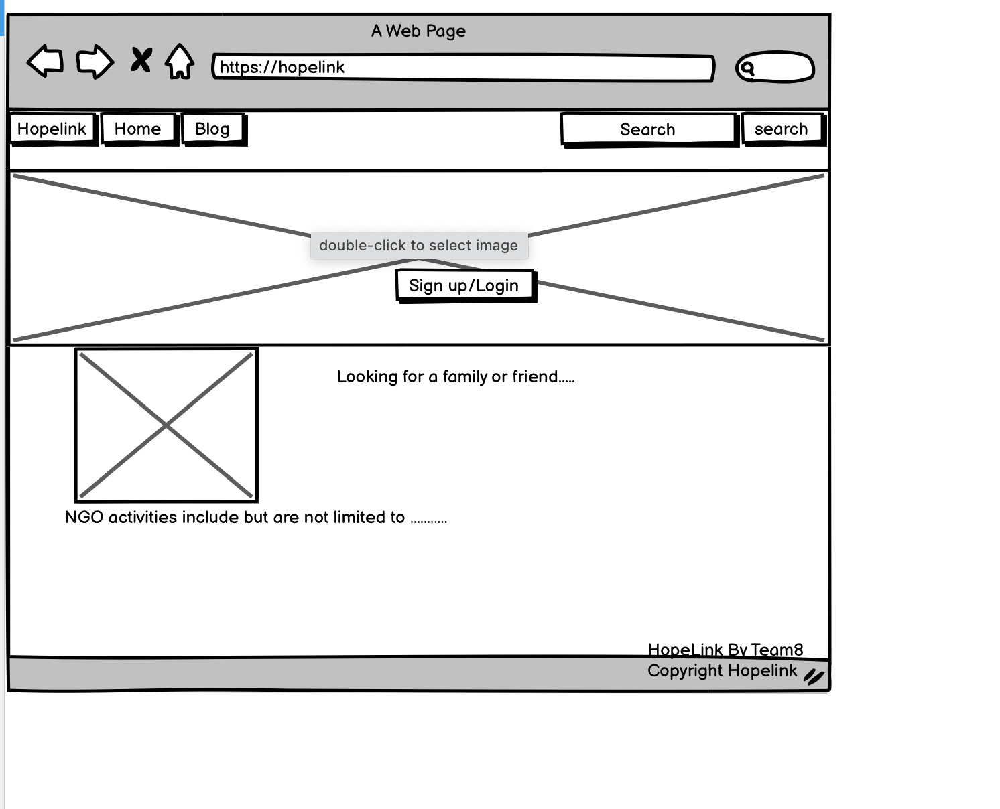
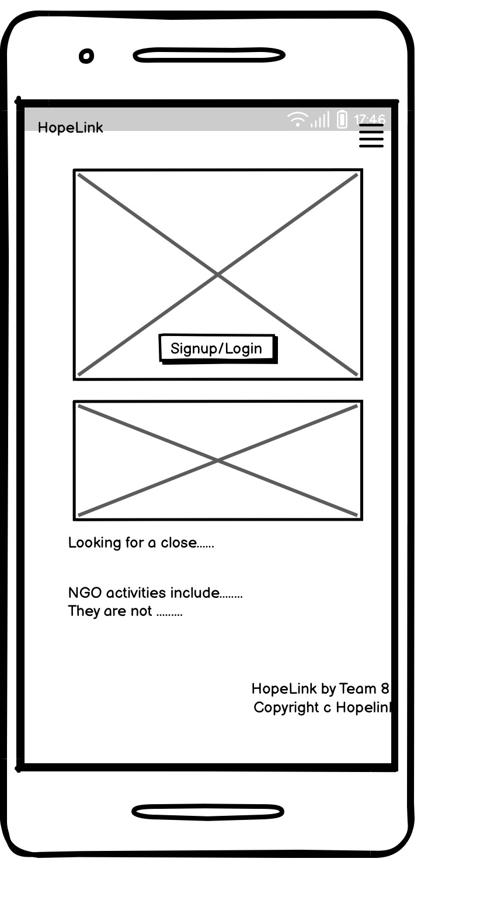
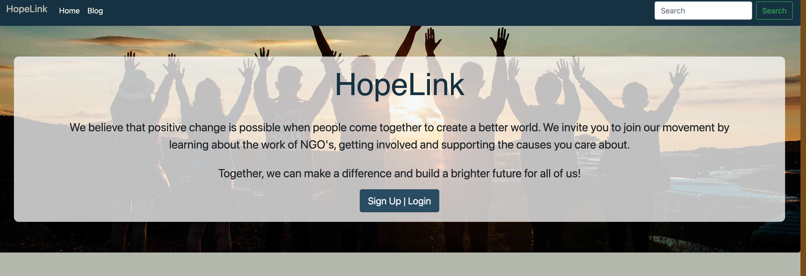

# World NGO Day Hopelink
## Hopelink website is a full stack website created to raise awareness on the incredible work been done by NGO's across the world.

## Live Preview   
 * ### For a live preview click: [Hopelink(https://8000-beratzorlu-hopelink-goxha2chfgb.ws-eu87.gitpod.io/)

## List of Features.
* UX/UI
   * Entity Relationship Model
   * Agile Methodology 
   * Color scheme
   * Font Used
   * User Stories
* Site Goals
* Design Choices
* User stories
* Wireframes
* Database Structure
* Manual and Automated Testing
* Deployment
* Citation 
* Future features

## UX 
* Entity Relationship Model.

## Agile Methododlogy 
This project was created using the Github Kanban board.

## Color Scheme 

## Fonts Used

## User Stories
        * As a site user I would like to have an option that, if I'm logged in, so there will be an option for a logout.
        * As a site user I would like to view the different NGO's work and contributions to the society.
        * As a site user I would like to read the news on the blog.
        * As a site user I would like to connect with friends.
        * As a site user I would like to search for the Ngo's around my vicinity.
        * As a site user I would like to have a contact option to contact an NGO.
        * As a site user I would like to comment on the blog news.

    * ## Admin Stories 
        * As a site admin I would like to add different NGO organizations.
        * As a site admin I would like to add an approval/delete option so that users can comment on the stories.
        * As a site admin I would like to create base html file which contains header/nav and footer for multiple pages.
        * As a site admin I would to add an option that users will be asked to login/sign up.

## Site Goals
* This website was created in relation to Code Institute World NGO Day 2023 Hackathon.

## Wireframes
* Project's wireframe was created by using Balsamiq wireframe. 
Site's wireframe may not be 100% due to changes made in the middle of the project.

## Header/nav
This informs the user about HopeLink has other features such as home nav button, blog and search buttons. It has alos has a sign up/login button.

## Bugs
Multiple bugs were encountered during production.
* Fixed bugs

* # Technologies Used

    * ## Languages Used
        * [HTML](https://www.w3schools.com/html/)
        * [CSS](https://www.w3schools.com/css/)
        * [Javascript](https://en.wikipedia.org/wiki/JavaScript)
        * [Python](https://www.python.org/)

    * ## Libraries/Framework Used
        * [Django](https://www.djangoproject.com/)
        * [Bootstrap](https://getbootstrap.com/)
        * [jQuery](https://jquery.com/)

     * ## Libraries/Module Installed
        * cloudinary==1.29.0
        * dj-database-url==1.0.0
        * dj3-cloudinary-storage==0.0.6
        * Django==3.2.15
        * django-allauth==0.51.0
        * django-bootstrap-datepicker-plus==4.0.0
        * django-bootstrap4==22.2
        * django-crispy-forms==1.14.0
        * django-phonenumber-field==7.0.0
        * gunicorn==20.1.0
        * oauthlib==3.2.1

    * # Deployments
* Git and GitHub are used for version control. Python is the backend language, and can't be displayed with GitHub alone, To live preview my project,Heroku was used.

* ## Heroku steps for deployment

## Credits
Craig Thomasson
Berat Zorlu
Rob Sizeland
Fatima Qaiser
Samuel Ukachukwu
Gbemisola Ajebeku

